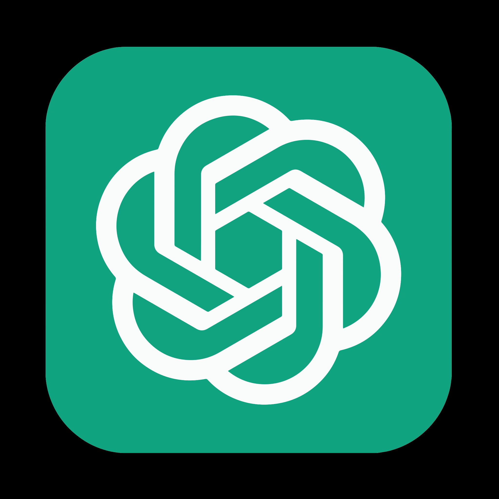
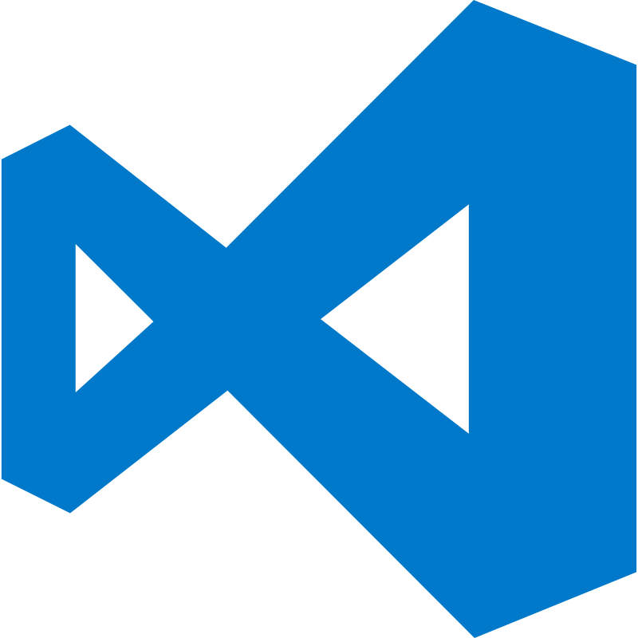
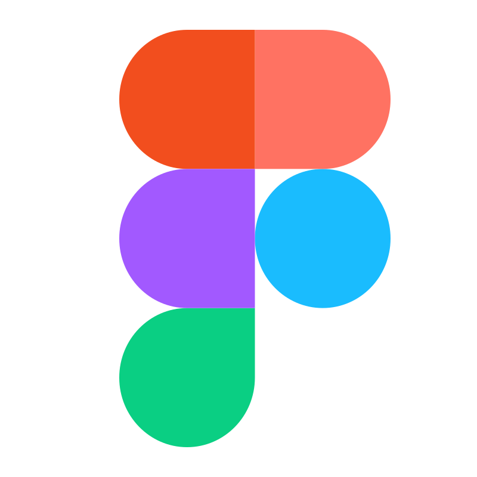
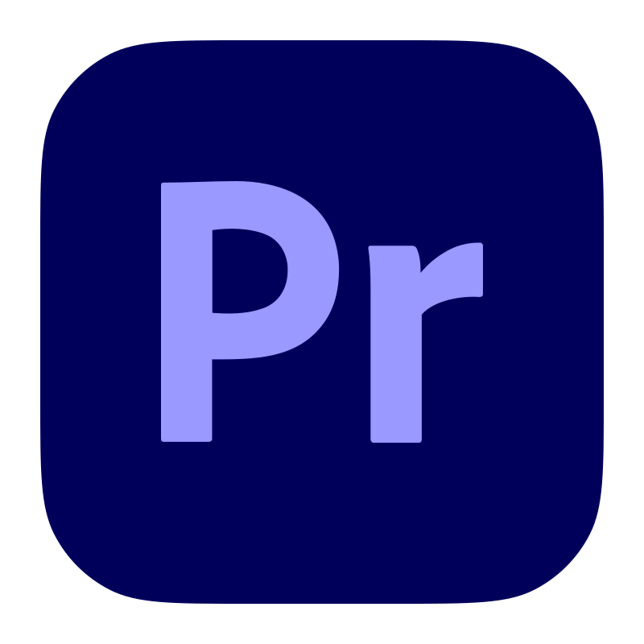

[Русский](./docs/README_RU.md) [Spanish](./docs/README_ES.md)

# About Me

I am Adam Lean, I software developer and musician.

## Tools

### Development

     
    

<!--   -->

### Music & Media

   
  

## Crash The Routines

[Crash The Routines](https://github.com/CrashTheRoutines) is a "workshop" for the mass production of websites, applications, scripts and bots for messengers.

## Projects

- [Script2Call](https://script2call.netlify.app) (Script manager for call centers) - **Work in progress**
- [Plastic Cult](https://github.com/adamlean/plasticcult) (Bot for automatic publication in telegram channel) - **Work in progress**

## Music

1. [Factory Revolt](https://rave.bz/gJSS0X)

- Radical left, anti-war thrash metal/hardcore project. For a long time, due to censorship, it was not possible to publish music on streaming platforms. Project is not active.

2. **exhum0**

- Boom bap project inspired by 90s hip-hop, 2000s urban R&B, soul and funk, as well as ethnic jazz music. The project is not active at the moment.

3. **Other Projects**

- Therefore, I do not consider it necessary to write anything about them.
