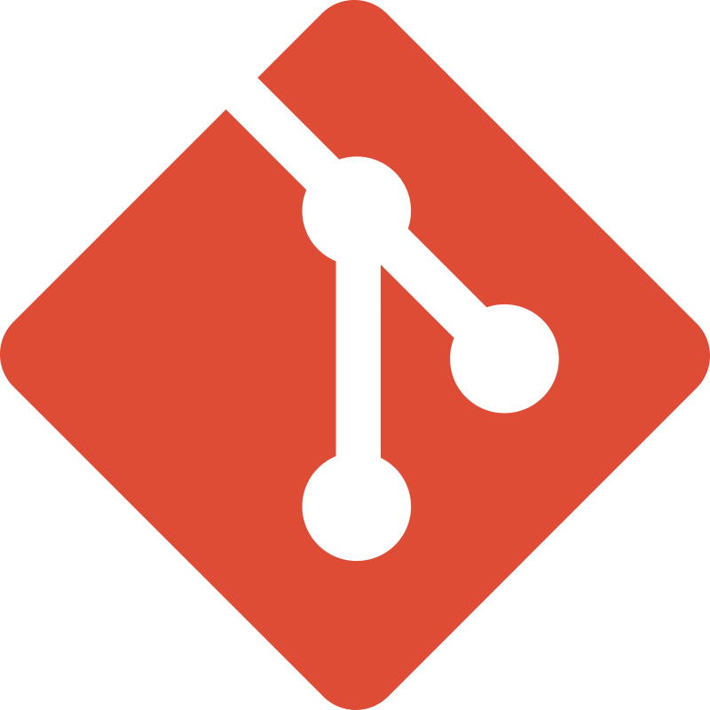

# About Me

I am Adam Lean, I software developer and musician.

## Tools

### Development

       
    

### Music & Media

   
  

## Crash The Routines

[Crash The Routines](https://github.com/CrashTheRoutines) is a "workshop" for the mass production of websites, applications, scripts and bots for messengers.

## Projects

- [Script2Call](https://script2call.netlify.app) (Script manager for call centers) - **Work in progress**
- [Plastic Cult](https://github.com/adamlean/plasticcult) (Bot for automatic publication in telegram channel) - **Work in progress**

## PS:

I do not work with government, military and religious organizations.

## Links

- [Website](https://exhum0.netlify.app)
